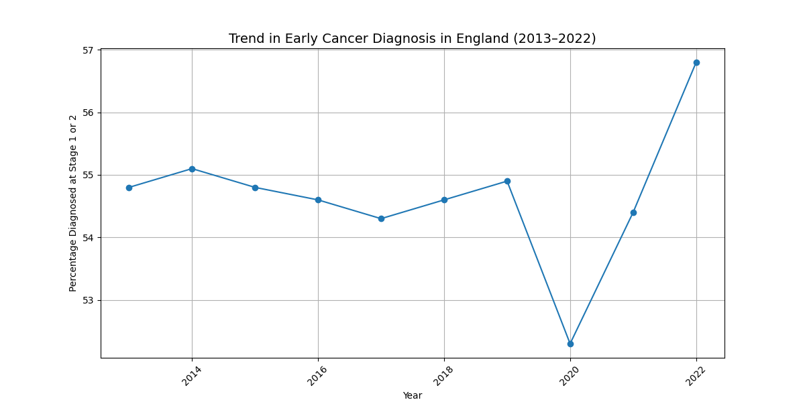

## 1. The Problem
   
Early cancer diagnosis significantly improves survival outcomes and reduces treatment complexity. Monitoring trends in early-stage diagnosis helps assess healthcare system performance.

This project investigates how the percentage of cancers diagnosed at Stage 1 or 2 in England has changed over time.

## 2. The Objective
   
- Analyse trends in early-stage cancer diagnosis
- Identify increases or declines over time
- Quantify changes using percentage differences
- Provide interpretation of possible contributing factors

## 3. Dataset
   
Source: Public NHS England dataset

Variables included:
- Year
- Percentage diagnosed at Stage 1 or 2
- 95% confidence interval (lower and upper bounds)

 ## 5. Visualisation

## 6. Key Findings

The analysis of NHS England data shows that the percentage of cancers diagnosed at Stage 1 or Stage 2 has generally increased over time. Early-stage diagnosis is a critical indicator in cancer care because detecting cancer earlier significantly improves survival rates and reduces the complexity and cost of treatment.

The visualisation created in this project highlights the trend in early cancer diagnosis across multiple years. By plotting the percentage of cancers diagnosed at Stage 1 or Stage 2, it becomes possible to observe how the healthcare system has progressed in identifying cancers earlier in the disease pathway.

Overall, the trend suggests gradual improvement in early detection. This may be linked to several factors including increased public awareness of cancer symptoms, improved screening programmes, advances in diagnostic technologies, and NHS initiatives aimed at diagnosing cancer earlier.

Despite the overall improvement, the data may also show periods where progress slows or fluctuates. These variations can occur due to changes in healthcare access, screening participation, or external pressures on the healthcare system such as service disruptions or resource constraints.

Monitoring trends like this is important for healthcare planners and policymakers. By analysing historical data, organisations such as NHS England can evaluate the effectiveness of cancer strategies and identify areas where further improvement is needed.

This project demonstrates how basic data analysis techniques using Python, pandas, and matplotlib can be used to explore healthcare datasets and generate meaningful insights about population health trends.

## 7. Conclusion

This project analysed NHS England data to examine trends in early-stage cancer diagnosis over time. The results indicate a gradual increase in the percentage of cancers diagnosed at Stage 1 or Stage 2, suggesting improvements in early detection within the healthcare system.

Earlier diagnosis is critical in cancer care because it allows for more effective treatment options and significantly improves survival outcomes. The upward trend observed in the data may reflect the impact of national screening programmes, increased public awareness, and improvements in diagnostic pathways within the NHS.

Although the data suggests positive progress, ongoing monitoring and analysis are important to ensure that early diagnosis rates continue to improve. Further analysis could explore differences across cancer types, regions, or demographic groups to better understand where additional interventions may be needed.

Overall, this analysis demonstrates how data can be used to monitor healthcare performance and highlight important trends that inform public health decision-making.

## 5. Tools Used

- Python
- Pandas
- Matplotlib
- Google Colab
- GitHub

 
